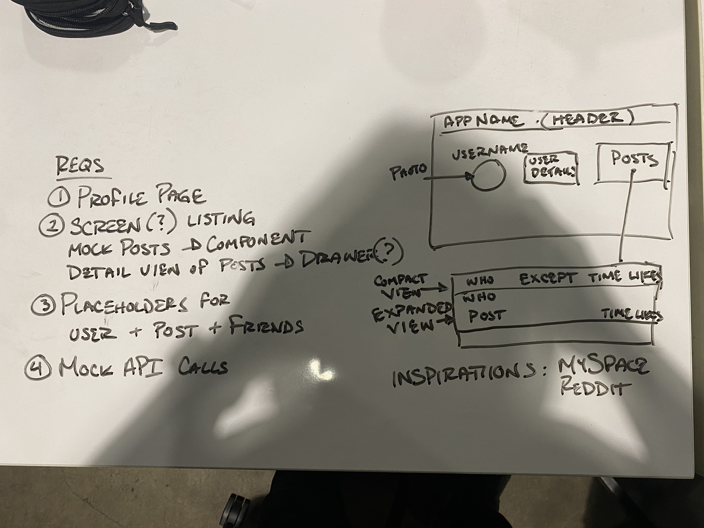
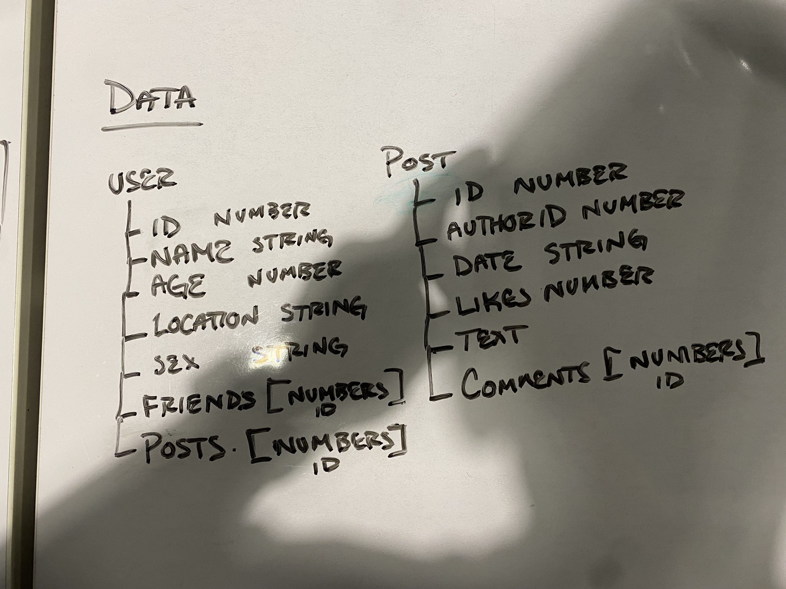
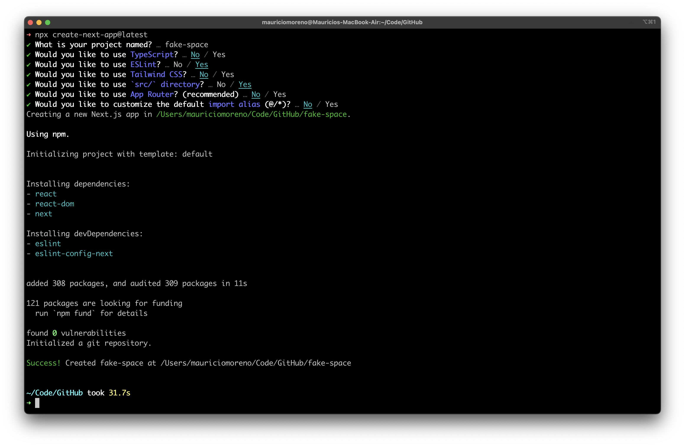

This is a [Next.js](https://nextjs.org/) project bootstrapped with [`create-next-app`](https://github.com/vercel/next.js/tree/canary/packages/create-next-app).

## Getting Started

First, run the development server:

```bash
npm run dev
# or
yarn dev
# or
pnpm dev
# or
bun dev
```

Open [http://localhost:3000](http://localhost:3000) with your browser to see the result.

You can start editing the page by modifying `pages/index.js`. The page auto-updates as you edit the file.

[API routes](https://nextjs.org/docs/api-routes/introduction) can be accessed on [http://localhost:3000/api/hello](http://localhost:3000/api/hello). This endpoint can be edited in `pages/api/hello.js`.

The `pages/api` directory is mapped to `/api/*`. Files in this directory are treated as [API routes](https://nextjs.org/docs/api-routes/introduction) instead of React pages.

This project uses [`next/font`](https://nextjs.org/docs/basic-features/font-optimization) to automatically optimize and load Inter, a custom Google Font.

## Development Notes

Start Time: 6:50p
Scheduled end time: 8:50p

## Project Requirements





## Decision Log



- Next.js - familiarity and ease of use
  - Page router - familiarity
- JavaScript - familiarity and development speed
- Material UI - familiarity and will be useful for planned posts component
- EsLint - keeps code clean, consistent and legible

- Going to make the landing page our profile page
- Will make the header part of the layout to be shared with other future pages

- Ready to start building the profile page
- Added getServerSideProps to lay foundation for API calls later
- Noticed I forgot a field for profileImage. Data model will need to be updated

- Profile UI took a little longer than I wanted it to
- Decided to move on to making the mock user query

- Decided to work on the post section and mock API call next
- Created the route to return the mock data
- Implemented the MUI accordion component to be able to expand and collapse posts
